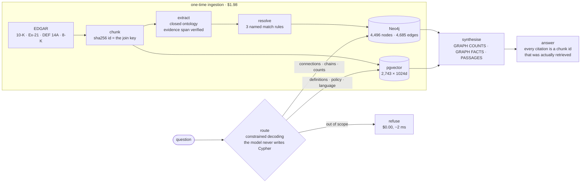

# Knowledge Graph RAG for Enterprise Data

Hybrid knowledge-graph + vector retrieval over SEC filings, running entirely on **open-weight
models** (Fireworks-hosted). Built to answer questions that require two or three hops across
related entities — the class of question where plain vector RAG quietly fails.

## Benchmark vs. plain vector RAG

Same 65 questions, same synthesiser, same citation contract. The only difference is
retrieval: the baseline embeds the question, takes the top 10 passages, and makes no router
call at all. Accuracy is answer correctness, graded by a judge that is validated before it is
quoted (below), with a judgement-free structural key reported alongside it.

| slice | n | vector-only | graph + vector | delta | 95% CI |
|---|---|---|---|---|---|
| 1-hop | 30 | 0.633 | **0.733** | +0.100 | [-0.067, +0.267] — parity |
| 2-hop | 10 | 0.100 | **0.800** | +0.700 | [+0.400, +1.000] |
| 3-hop | 12 | 0.083 | **0.417** | +0.333 | [+0.083, +0.583] |
| aggregation | 8 | 0.125 | **0.750** | +0.625 | [+0.125, +1.000] |
| out-of-scope (refuse) | 5 | 0.800 | 1.000 | +0.200 | [+0.000, +0.600] |
| **all** | **65** | **0.400** | **0.708** | **+0.308** | **[+0.169, +0.446]** |

| | vector-only | graph + vector |
|---|---|---|
| latency p50 | **6,823 ms** | 13,362 ms |
| latency p95 | **10,658 ms** | 18,894 ms |
| $ per query | **$0.00144** | $0.00162 |
| one-time ingestion | **$0.00** | $1.98 |

**Parity at one hop, and a gap that opens with depth.** The 1-hop interval crosses zero, so
the two systems are indistinguishable there on 30 questions — which is the honest version of
the result the spec predicts, and a stronger claim than a small unexplained edge. Every
multi-hop and aggregation interval clears zero: 0.091 → 0.591 across the 22 multi-hop
questions. That curve is the whole point. Embeddings answer what a passage states and lose
what a chain implies.

**And the graph arm is twice as slow and 13% more expensive per query**, on top of $1.98 to
build the graph in the first place. It makes two sequential model calls where the baseline
makes one — the router is ~6.7s of the 13.4s p50, and actual retrieval, graph traversal
included, is **31 ms**. Nothing here is slow because of the graph; it is slow because
answering takes two LLM calls.

Intervals are a paired bootstrap over per-question correctness, 10,000 resamples, fixed seed.
Slices of 5-12 questions cannot resolve a small difference and say so — and re-running the
same code end to end moves a slice by about one question, which is the other reason to read
intervals rather than third decimals.



## Status

| Phase | | |
|---|---|---|
| 1 | Entity + relationship extraction into Neo4j | **complete** — 4,496 entities, 4,685 edges, gate passing |
| 2 | pgvector index over the same chunks | **complete** — 2,743 chunks × 3 widths, recall measured by hop count |
| 3 | Question router (graph vs. vector) | **complete** — 95.4% routing accuracy, multi-hop recall 2.5x the vector baseline |
| 4 | Grounded answer synthesis with validated citations | **complete** — 319 citations, 0 invented; aggregation 8/8 exact |
| 5 | Benchmark vs. vector-only baseline | **complete** — 0.400 → 0.708 overall, parity at 1-hop, +0.700 at 2-hop, at 2x the latency |

## Phase 1 results

24 semiconductor filers → a queryable graph, for **$1.41** of a $55 budget.

| | |
|---|---|
| Corpus | 2,743 chunks from 4 form types; 2,741 extracted, 2 quarantined |
| Extraction | 14,431 mentions, 7,655 relations kept |
| Dropped by validation | 882 (10.3%), of which 780 failed the evidence-span check |
| Resolution | 5,174 surface forms → 4,496 entities |
| Graph | 4,496 nodes, 4,685 edges, all 14 relation types populated, 0 self-loops |
| `kgrag verify` | **PASS** |

The 780 relations dropped for `evidence_not_found` are the hallucination filter earning its
keep: every relation must carry a verbatim span that survives a substring check against its
source chunk, so a fabricated fact is discarded without a second model call.

### Entity resolution

Measured against 337 labelled pairs, held out per-pair: **precision 1.000, recall 0.297.**

The labels are derived from the filings rather than hand-judged — positives from aliases a
filing declares about itself (`NXP Semiconductors, N.V. ("NXP")`), negatives from Exhibit 21,
which exists to enumerate separate legal entities, so any two rows differ by construction.

Recall is rules-only by design. The rules are deliberately conservative because a false merge
is far more expensive than a missed one: merging a parent with its subsidiary collapses their
`SUBSIDIARY_OF` edge into a self-loop that then gets discarded. That bug cost 317 edges — 47%
of the relation — before it was caught, and the counter reporting it printed on a *passing*
run. Declared aliases supply the remaining recall in production.

### Model bakeoff

Three models over the 20 hand-labelled gold chunks, through the identical
schema-and-validation path that shipped:

| Model | Cost | Wall clock | Mention recall | Relation recall | Failed chunks |
|---|---|---|---|---|---|
| **gpt-oss-120b** (production) | $0.0365 | 249 s | **0.835** | **0.575** | 0/20 |
| gpt-oss-20b | $0.0365 | 1,113 s | 0.767 | 0.400 | 2/20 |
| llama3.2:3b (local, Ollama) | — | 3,580 s | 0.340 | 0.037 | 5/20 |

**Read recall, not precision.** The gold set labels 103 mentions where the same chunks yield
305 from the model — on an Exhibit 21 chunk the labeller stops at 11 rows and the model takes
all 68. Gold is a subset of truth, not a complete answer key, so recall is meaningful while
precision measures how thorough the labelling was, penalising the most thorough model hardest.

Two results worth stating plainly. **The cheaper hosted model is not cheaper**: gpt-oss-20b is
priced at under half per token and cost the same, generating 25% longer responses and burning
retries on schema compliance, while taking 4.5x as long. And **a 3B local model is not viable
for this task on this hardware** — llama3.2 failed 5 of 20 chunks outright and found 3 of 80
relations, in an hour. Constrained decoding guarantees schema-valid output; it guarantees
nothing about whether anything correct is inside it.

### Known limitations

- **45 self-loops still discarded** at load, down from 321. These are names like
  "Applied Materials GmbH" whose legal form `normalize()` strips, leaving them exact-matching
  their parent with no place word left to separate them. ~6% of the subsidiary relation.
- **Orphan rate is 24.8%**, against a `verify` threshold raised from 5% to 30% after measuring
  it. Of 462 orphan companies only ~39 are subsidiary shells that arguably should have an
  edge; the rest are peripheral mentions a closed 14-relation ontology has no edge for —
  former employers in director bios, competitors named in passing. The extractor declining to
  invent a relation for those is correct behaviour, not a gap.
- **The gold set cannot measure precision** (see above), which limits the bakeoff to a
  recall comparison.
- **2 chunks were never extracted**, quarantined after repeated API failures.

## Phase 2 results

2,743 chunks embedded into pgvector at three widths for **$0.57**, joined to the graph on
the chunk ids Phase 1 minted.

### Retrieval recall@k, by hop count

Exact search at 1024 dims, against 52 answerable questions:

| slice | n | R@1 | R@5 | R@10 | R@20 |
|---|---|---|---|---|---|
| 1-hop | 30 | 0.233 | 0.444 | **0.586** | 0.628 |
| 2-hop | 10 | 0.178 | 0.268 | **0.288** | 0.370 |
| 3-hop | 12 | 0.142 | 0.328 | **0.328** | 0.398 |
| all | 52 | 0.202 | 0.384 | 0.469 | 0.525 |

**Multi-hop retrieval runs at roughly half of single-hop.** That gap is the point — it is
the vector-only baseline the Phase 5 benchmark measures the graph against, and a flat curve
here would have meant the question set was too easy to be worth running.

The set is built to be able to lose. Labels come from filing structure rather than
judgement, the same principle as `kgrag mine-pairs`: every edge already carries the
`chunk_ids` whose text justified it, so those chunk ids are the answer key. Multi-hop
questions never name the middle entity, and a chain is discarded unless its evidence spans
more than one filing — a chain described inside a single chunk is a 1-hop question in
costume. 47 questions are mined this way; 10 more are hand-written for the shapes the miner
cannot produce (aggregations, paraphrases, out-of-scope refusals).

Gold sets are floors, not exhaustive — other chunks may also answer a question. The bound
applies identically to every width, which is what keeps the comparison below fair.

### Embedding width: 1024 vs 2000 vs 4096

`qwen3-embedding-8b` emits 4096 dims and pgvector will not HNSW-index above 2,000, so the
production column has to be a truncation. Qwen3 is Matryoshka-trained, which is the usual
justification for truncating — so the whole corpus was embedded at all three widths and
scored, instead of citing it.

| | mean R@10 | vs 1024 | 95% CI |
|---|---|---|---|
| **1024** (production) | **0.469** | — | — |
| 2000 | 0.443 | +0.0266 | [-0.0186, +0.0891] |
| 4096 (native, unindexable) | 0.458 | +0.0112 | [-0.0433, +0.0769] |

Every interval crosses zero on a paired bootstrap, so truncation to a quarter of the native
width costs nothing detectable at n=52. Not "provably identical" — 52 questions cannot
resolve a small real difference — which is why the interval is published, not the point
estimate.

### HNSW recall vs exact search

| ef_search | 1 | 2 | 4 | 10 | 40 | 100 | 400 |
|---|---|---|---|---|---|---|---|
| recall@10 | .079 | .174 | .381 | .900 | .968 | .993 | 1.000 |

At **2,743 chunks an exact scan is already ~7 ms**, so HNSW here is a demonstration of the
technique rather than a necessity — ef=100 gives .993 recall at ~2.6 ms, a real but small
win. Saying so is better than implying otherwise.

Getting this curve to mean anything required forcing *both* planner arms. Left alone,
Postgres costs a sequential scan cheaper than an HNSW probe on a table this small and takes
it even when the index exists, silently answering the "ANN" arm exactly and reporting
recall 1.000 at every `ef_search`. The tell was non-monotonicity — ef=4 scoring above ef=40
— with ANN latencies sitting exactly on the exact baseline.

## Phase 3 results

A router picks the retrieval path per question. **Routing accuracy 62/65 (95.4%)**, and
routed retrieval beats the vector-only baseline at every hop count.

### R@10 by hop count — routed vs. the Phase 2 baseline

| slice | n | vector only | graph only | **routed** |
|---|---|---|---|---|
| 1-hop | 30 | 0.586 | 0.792 | **0.728** |
| 2-hop | 10 | 0.288 | 0.775 | **0.758** |
| 3-hop | 12 | 0.328 | 0.704 | **0.671** |
| all | 52 | 0.469 | 0.768 | **0.721** |

(Aggregation is measured separately — see Phase 4. R@10 is not a meaningful metric on that
slice, and mixing it in would move these figures without measuring anything.)

The 2-hop slice is the headline: **0.288 → 0.758, a 2.6x improvement**, on exactly the
questions vector search is structurally unable to answer because the middle entity is never
named. The gap widens with hop count, which is the shape the project exists to demonstrate.

The vector column is not re-derived here — it reproduces Phase 2's 0.586 / 0.288 / 0.328
exactly, and `kgrag route` runs both paths for every question specifically so that it does.
If that column ever stops matching, the harness is broken and nothing else in the table
should be believed.

Note that **graph-only outscores routed** overall (0.768 vs 0.721). Routing is not free
accuracy — it sends some questions to vector that the graph would have answered better. The
honest reading is that the router is currently leaving ~5 points on the table, not that
routing is a win in itself. What routing buys is refusing out-of-scope questions and not
running a traversal for questions that have no graph answer.

### Routing accuracy

| slice | n | correct | accuracy |
|---|---|---|---|
| out-of-scope | 5 | 4 | 0.800 |
| 1-hop mined | 27 | 27 | **1.000** |
| 1-hop hand-written | 3 | 3 | **1.000** |
| multi-hop | 22 | 20 | 0.909 |
| aggregation | 8 | 8 | **1.000** |
| **all** | **65** | **62** | **0.954** |

Expected routes are derived from the eval set rather than hand-assigned, the same discipline
`kgrag mine-questions` uses for gold chunks: `hops == 0` must refuse, `hops >= 2` must reach
the graph, aggregation must reach the graph (no ten passages contain a corpus-wide
total), and the hand-written 1-hop paraphrases must reach vector. Mined 1-hop questions
accept either path — they are templated off a graph edge *and* quote the canonical entity
name verbatim, so both paths are legitimately correct and scoring one would be inventing a
ground truth.

### The model never writes Cypher

A relationship type cannot be a Cypher bind parameter, so it has to be interpolated. The
only thing between the model and the query string is `RelationType(...)`, which raises on
anything outside the fourteen-member ontology — the same rule `load.py` already enforces at
write time, applied at read time. The model returns enum members and an entity name:

```
chain [DIRECTOR_OF, ACQUIRED]  ->  -[r0:DIRECTOR_OF]->()-[r1:ACQUIRED]->()
```

That is four traversal shapes over one template instead of ~25 hand-written query strings,
with every relation reachable and every chain up to length 3 expressible.

### What the measurements caught

**The fulltext index built for entity lookup cannot do entity lookup.** Phase 1 created a
fulltext index on `[e.name, e.aliases]` with a comment saying it existed so a question
saying "AMD" could find the canonical node. It returns `AMD Ryzen™ PRO`, and filtered to
companies it returns `AMD (EMEA) LTD.` and `AMD Japan Ltd.` — the right node carries "AMD"
among eleven aliases, and Lucene normalises by field length. An exact index over the same
aliases keyed on `resolve.normalize` resolves every case: 4,629 surfaces, 28 ambiguous,
broken by `mention_count`.

**`gpt-oss-20b` is not viable as the router, and the failure is not slowness.** It stalls
reproducibly on 6 of 57 questions — the same six every rerun, unaffected by a longer
deadline. "What is home automation solutions, and who sells it?" times out at 45s on 20b
and is answered by `gpt-oss-120b` in 1.2s. The tell was not a bill or an error rate: a
failed call records no usage, so a rerun reported **$0.00000** while six questions silently
stayed unrouted. This is Phase 1's `llama3.2:3b` result again — a smaller model that
answers most inputs and hangs on the rest is unusable at any price.

**Describing the corpus as "24 companies" made the router refuse its own contents.** Four
of six routing errors were entities that are *in* the graph but are not filers: a subsidiary
(Picosun Japan), a product, an auditor's officer, a litigation counterparty. The filings
name thousands of such entities. Correcting that one paragraph took 1-hop accuracy from
23/27 to **27/27** and overall from 0.895 to 0.947.

### Known limitations

- **One out-of-scope question is arguably mislabelled, not misrouted.** `h007` ("Who is the
  chief executive of OpenAI?") is gold-labelled out-of-scope because OpenAI is "outside the
  24-filer corpus" — but OpenAI *is* in the graph, a Company node with 5 mentions,
  `PARTNERS_WITH NVIDIA` and two `DIRECTOR_OF` edges. The fact asked for is absent; the
  entity is not. The row is left as-is pending a decision, since the hand-written eval rows
  are not regenerable.
- The two remaining genuine errors are multi-hop questions routed to vector (`h001`, `m032`).
- Refusal happens before retrieval, so it is a judgement about corpus scope made without
  looking at the corpus. Phase 4's citation validation is the real backstop.
- Router cost is **$0.021 per full 57-question sweep** on `gpt-oss-120b`, content-cached, so
  reruns are free.

## Phase 4 results

Both retrieval paths merge into one answer, and **every published citation resolves to a
chunk that was actually retrieved** — 319 citations across two full sweeps of 65 questions,
zero invented.

A citation is a chunk id: the same 16-character key minted in `chunk.py`, carried on every
Neo4j edge and used as the pgvector primary key. Validating one is a set-membership test
with no mapping to get wrong, and it is what lets a graph-derived fact and a retrieved
passage cite in the same currency.

### Does constrained decoding beat reject-and-regenerate?

The spec asks to reject invalid citations and regenerate. `ontology.py`'s design says to put
the retrieved ids in the schema as an `enum` so an invalid one is unreachable. Both were
built and run over the same 65 questions, uncached, so latency and cost are measured.

| | free (validate + regenerate) | constrained (enum) |
|---|---|---|
| answers produced | 51/65 | **53/65** |
| claims / citations | 85 / 158 | 94 / 161 |
| **invented ids published** | **0** | **0** |
| citations needing a delimiter strip | 566 | **0** |
| answers needing a repair round | 1 | 0 |
| answers abandoned after repairs | **2** | **0** |
| out-of-scope refused | 5/5 | 5/5 |
| answerable wrongly refused | 9/60 | 7/60 |
| aggregation exact counts | 8/8 | 8/8 |
| latency p50 / p95 | 6,628 / 12,768 ms | 6,516 / **9,870** ms |
| $ per answered question | $0.00145 | $0.00131 |

**The constraint is free, and it buys two answers.** Same refusal behaviour, lower tail
latency, marginally cheaper because it never pays for a regeneration — and it deletes the
repair loop entirely.

### The model never actually hallucinated a citation

This is the result worth stating plainly. Every citation the free arm rejected turned out to
be a **formatting artifact over real retrieved ids**, not an invented source:

- ~570 per sweep were the id copied with its delimiter — `[c8608131724ee274]`.
- The two abandoned answers packed several ids into one JSON string:
  `"00ce393a62cbff06] [21c81acc49148857"`. All seven constituent ids were genuinely
  retrieved.

So reject-and-regenerate caught zero hallucinations, because there were none to catch. What
it caught was punctuation — and it threw away two correct answers doing so. Constrained
decoding cannot emit a malformed citation at all, which is why it ends with more answers
rather than fewer. The delimiter strip is deliberately narrow (surrounding brackets and
whitespace only), so a fabricated or truncated id would still fail.

### Graph paths become sentences before they reach the prompt

Raw triples generate awkward text, so each edge is rendered through one phrase per relation
in `ontology.RELATION_PHRASE`, subject-first, with its chunk ids attached:

```
GRAPH FACTS (derived from the knowledge graph)
[2f5b29f93fecbae1] ADVANCED MICRO DEVICES INC is exposed to the risk of export controls...
[234156833fa87f30] TSMC supplies ADVANCED MICRO DEVICES INC
```

That second line is the one that matters. A neighbourhood walk is undirected, so half its
edges arrive against their stored direction — direction is read off the relationship
(`startNode`/`endNode`), never off path order. Read it off the path and the system publishes
"AMD supplies TSMC": confident, well-cited, and exactly backwards, with no error anywhere.

### Aggregation: you cannot count from a top-k sample

"How many subsidiaries does AMD list?" was unanswerable while the graph held the answer
exactly. A ranked walk returns AMD's ten best-corroborated chunk ids — risk and auditor
edges — and the 32 `SUBSIDIARY_OF` edges never make the cut. No value of k fixes that,
because a count is a property of the whole neighbourhood.

Counts are now computed by Cypher over the entire neighbourhood, grouped by predicate **and
direction**, and handed over as stated facts:

```
GRAPH COUNTS (complete, computed over the whole graph — do not recount)
[708d2e33283bdf29] ADVANCED MICRO DEVICES INC has 32 subsidiaries (complete count from
the knowledge graph): Mipsology S.A.S.; Xilinx, Inc.; ... and 24 others.
```

**8/8 exact counts correct**, grounding precision **1.000** on the slice.

### The near-miss count: correctly cited, and wrong

The first version of this answered *"AMD operates in 11 countries."* AMD's own `OPERATES_IN`
has 11 endpoints; its subsidiaries' `INCORPORATED_IN` has 11 distinct locations. Two
unrelated sets that happen to share a size — and neither counts countries, because
`Location` spans streets, cities, states and regions (AMD's eleven include `United States`,
`U.S.`, `Europe`, and `2485 Augustine Drive, Santa Clara, California 95054`).

**Citation validation cannot catch this.** The citation resolved; the claim was grounded in a
real chunk; it simply answered a different question. Every mechanism built to catch invented
sources reports green. The prompt now forbids substituting a near-miss count, and the answer
schema supports partial answers — so `h000` returns the exact 32 and names the country count
as unsupported, which is the truthful shape of that question.

### Where R@10 stops meaning anything

| slice | n | vector | graph | routed |
|---|---|---|---|---|
| 1-hop | 30 | 0.586 | 0.792 | 0.728 |
| 2-hop | 10 | 0.288 | 0.775 | 0.758 |
| 3-hop | 12 | 0.328 | 0.704 | 0.671 |
| **aggregation** | **8** | **0.274** | **0.088** | **0.088** |

The graph scores 0.088 on the slice it answers **8/8 correctly**, and loses to vector there.
Both are true: the answer is a computed total, not a passage, so recall against gold chunks
measures the wrong object, and a 45-chunk gold set cannot be recalled at k=10.

Phase 5 is built on recall-as-proxy and that assumption does not extend here — the
aggregation slice must be scored on correctness. Which needs no judge: the count came from
Cypher, so `expected_count` in each eval row is an exact answer key derived from structure.

### Refusal moved from a guess to a fact

Phase 3's `refuse` is a judgement about corpus scope made *before* looking at the corpus.
Grounding is the real backstop, and it costs nothing: a refused question short-circuits
before any model call at **$0.00000 and ~2 ms**. All 5 out-of-scope questions are refused.

`h007` — "Who is the chief executive of OpenAI?" — is exactly this case, and the reason its
Phase 3 label was left alone. OpenAI is in the graph; the fact asked for is in no filing.
The system now reaches retrieval and refuses for the true reason instead of guessing.

### The endpoint

```bash
uv run uvicorn kgrag.api:app
curl -s localhost:8000/ask -H 'content-type: application/json' \
     -d '{"question":"Who is INTEL CORP'"'"'s independent auditor?"}'
```

```json
{"answerable": true,
 "answer": "Intel Corp's independent auditor is Ernst & Young LLP.",
 "route": "graph",
 "citations": ["c8608131724ee274", "ecec386ead8c9bcc"]}
```

Both citations are m001's full gold set. The Neo4j driver and the 4,629-surface entity index
are built once at startup; the psycopg connection is per-request.

## Phase 5 results

Two systems, the same 65 questions, the same synthesiser, the same citation contract. The
only difference is retrieval: the baseline embeds the question, takes the top 10 passages and
makes **no router call at all**, because a plain vector RAG stack has no router to pay for.
Both arms ran uncached, so latency and cost are measured rather than read back off disk.

### Latency, honestly: two model calls, and 31 ms of retrieval

| stage | p50 |
|---|---|
| router LLM call | ~6,700 ms |
| graph traversal + vector search | **31 ms** |
| synthesis LLM call | ~6,700 ms |

The graph contributes **0.2% of the latency**. The rest is two language-model calls in
sequence, and the baseline pays one of them, which is exactly why it is twice as fast.
Latency tracks *output* length far more than input (r = +0.59 vs +0.18): the tail is
questions with long answers, not questions with big contexts.

That decomposition suggested two fixes. **Both were measured and both were largely wrong**,
which is why they are written up here rather than shipped as claims.

**Streaming the answer buys 0.5-6%, not 90%.** Latency correlates with output length
(r = +0.59) far more than with input (+0.18), so the obvious read is that the model spends
its time writing and a user should see the first words in under a second. Measured directly,
**73% of the synthesis call elapses before the first content token exists**: `gpt-oss-120b`
is a reasoning model, and the answer is written in 2.9s of an 11.1s call. Output length
correlates with latency because longer answers need more *reasoning*, not because writing is
slow. Time to first claim against the complete answer: 9,472 vs 10,099 ms on a five-claim
answer, 8,296 vs 8,342 ms on a one-claim answer.

The endpoint ships anyway (`POST /ask/stream`), because it is the right architecture and it
costs nothing — but the honest number is a rounding error, and the reason is worth more than
the feature.

**Halving the prompt cut cost 19% and latency 1%.** Ten passages at ~36k characters produce
a 137-character answer at p50, so five passages looked like free latency. It is free *cost*
— $0.00162 → $0.00131 — and no latency at all (13,362 → 13,194 ms p50), which is the same
finding from the other side: the prefill is not what you are waiting for. Accuracy went
0.708 → 0.677 with 3-hop falling out of significance and refusals rising 6 → 9. The default
stays at 10; `--passages N` stays as a measurement tool.

**What actually moves it: `reasoning_effort`.** On the same question, same answer shape,
`low` versus `high` is **16,872 ms → 6,125 ms** with reasoning tokens dropping 1,010 → 132.
That is a 64% cut and it is untested against accuracy — a real experiment, not a setting to
flip, because it changes every answer and would need the whole benchmark re-run to publish.

What would *not* help, in any version: tuning the index. `ef_search` is not in the critical
path at all.

**This table exists because the first version of it was wrong.** Phase 5's latency was
measured with `kgrag answer --no-cache`, which bypassed the answer cache and left the router
reading its own — a ~6.7s call served from disk in 16 ms, on the arm being compared against a
baseline that has no router at all. The flag now reaches every model call a query makes, and
`test_no_cache_reaches_the_router_not_just_the_synthesiser` fails if it stops doing so. Third
time this project has timed its own cache; the first two are in the table below.

### Where the baseline actually fails

Not by hallucinating. Vector-only **refuses 29 of 60** answerable questions where the hybrid
refuses 7, and the refusals are honest: it retrieves ten passages about the right company and
correctly reports that the fact asked for is not in them. *"The provided passages list many
AMD subsidiaries"* — and the question asked how many there are.

| judge verdict | vector-only | graph + vector |
|---|---|---|
| correct | 26 | **46** |
| partial | 1 | 2 |
| incorrect | 7 | 6 |
| **refused an answerable question** | **29** | **6** |
| unverifiable (the eval set, not the system) | 2 | 5 |

That is the failure mode this project set out to find. A two-hop question names one entity and
asks about something reached through another, so the passages that answer it never share
enough surface with the question to rank. Nothing is wrong with the retrieval — the question
is not a retrieval question.

### Two instruments, never blended

| slice | n | keyed | key: vector | key: hybrid | judge: vector | judge: hybrid |
|---|---|---|---|---|---|---|
| 1-hop | 30 | 23 | 0.565 | 0.739 | 0.633 | 0.733 |
| 2-hop | 10 | 10 | 0.000 | 0.500 | 0.100 | 0.800 |
| 3-hop | 12 | 10 | 0.000 | 0.500 | 0.083 | 0.417 |
| aggregation | 8 | 8 | 0.000 | 0.875 | 0.125 | 0.750 |
| out-of-scope | 5 | 5 | 0.800 | 1.000 | 0.800 | 1.000 |
| all | 65 | 56 | 0.304 | 0.696 | 0.400 | 0.708 |

- **The key** has no opinion: `expected_count` for aggregation, and for every mined question
  the far endpoint of the edge it was templated off — 43 of 47 rows carry one, matched
  through the alias surfaces resolution already mined. Two templates key on nothing and say
  so: *"what does X supply to Y"* is answered by a product, not by an endpoint.
- **The judge** reads the filing text that justified the edge and grades the fact asked for.

The key is a **floor**, and not a neutral one — it matches on surface form, and the graph arm
answers in canonical entity names while the baseline answers in filing prose. That is exactly
why it is not the only instrument, and why the two are reported side by side rather than
averaged.

### The instrument was wrong twice before it was right

Every number before this phase was about *retrieval* or *provenance*. Neither says an answer
is correct. Correctness needs a grader, and a grader is an instrument that has to be measured
first — this project has twice shipped an eval that could not fail.

**Version 1** graded against gold chunks alone, four of them, truncated to 4,000 characters.
The key and the judge disagreed on 19 of 48 hybrid answers, almost all `key=correct,
judge=incorrect`. A one-directional disagreement is a bias, not noise, so the disagreements
got read:

- 14 of 65 questions carry more than four gold chunks. `m039` has nine, the judge saw four,
  and truthfully reported that the reference said nothing about competitors — a verdict about
  a reference this repo had crippled, published as a verdict about the answer.
- `m005`'s supporting sentence sits at character 3,521 of its chunk. Per-chunk truncation is
  a coin flip on whether the graded evidence is even visible.
- Gold sets are floors — the README has said so since Phase 2 — and the judge treated them as
  exhaustive. Applied Materials was marked wrong for naming Santa Clara, Intel for naming the
  European Commission. Both true; neither in a one-chunk reference.

The third is the one that matters: **penalising unverifiable additions penalises the arm that
retrieves more**, on the exact axis the benchmark claims to measure.

**Version 2** fixed the reference and still broke its own rule. Intel's answer named the SEC
(the keyed answer) *and* the European Commission, and came back incorrect for "contradicting
the reference which only lists the U.S. SEC". The reference does not say *only*. Absence is
not contradiction, and the prompt now says so in as many words.

What made both findable is that the departures are printed **per row, by qid**. As an
aggregate, version 1 read as 60% agreement and looked like judge noise; as a list it read as
one failure mode repeated nineteen times. Hybrid key agreement across the three versions:
**29/48 → 42/48 → 47/48**, the last with a single override, `m039`, which is an omission
correctly downgraded to partial.

### The judge is validated before it is quoted

`kgrag bench` runs three checks and prints them above the results:

| check | vector-only | graph + vector |
|---|---|---|
| A. reproduces the exact count key | 7/8 | 7/8 |
| B. agrees with the structural key | 46/48 | 42/48 |
| C. rejects an answer graded against a *different* question | 54/54 | — |

**C is the one that bites.** A judge that rubber-stamps plausible text passes A and B and
fails only this. Below 90% rejection, `bench` exits instead of publishing. It is also
adversarially hard rather than random: each answer is graded against its *neighbour* in the
eval set, which is often the same template with a different subject.

B's six hybrid departures are the interesting rows, not the agreement rate. Four are
**rescues** — the judge accepting a right answer the key rejected on surface form, which is
why the judge exists. Two are **overrides**, and one of them is `m010`, the Argentina/Uruguay
error below: the answer names the keyed entity and states something the filing contradicts.
That is the failure citation validation structurally cannot see.

A is a **sanity check, not an independent measurement**, and is labelled as one: the
aggregation reference carries the verified count, because the gold chunk is a page of an
Exhibit 21 and asking a model to count 67 names off it would grade the judge's arithmetic.

### `expected_count` is exact about the graph, and the graph is not the world

The judge overrode the exact count key once, and it was right. *"How many directors sit on the
board of Wolfspeed?"* — the graph says 38, the proxy says seven. Wolfspeed's `DIRECTOR_OF`
edges are a union over filings and periods; a board is a snapshot on a date.

That is a real limit on the number this project had been calling its only judgement-free
accuracy metric. Counts over things a filing enumerates once — subsidiaries in an Exhibit 21,
locations of operation — hold. The row stays in the eval set: it is not wrong, it is measuring
the graph, and deleting the one question that exposes the gap between the graph and the world
is exactly the eval-set edit this project keeps refusing to make.

### The benchmark found a real bug, and the fix is in these numbers

The first run of this benchmark scored 2-hop at 0.500, and the judge's reasons said why:
*"who competes with the customers that Teradyne supplies?"* was answered with **Teradyne's
own competitors**. The traversal had walked the chain correctly. `verbalise()` then flattened
it into twenty unordered sentences with nothing marking which edge was the last step, and
chain position is not recoverable from a pile of true facts.

Two lines of the same fix. A walk now renders whole —

```
GRAPH FACTS (derived from the knowledge graph)
[8f21…] [400380d68481bb05] TERADYNE, INC supplies Marvell Technology, Inc.
        → Marvell Technology, Inc. competes with NVIDIA CORP
```

— and `FACT_LIMIT` counts walks rather than edges. The second half mattered as much as the
first: walks arrive ranked by summed support, the last hop of a chain is the least
corroborated thing in it, so the edge that answers the question was the first one the cap
dropped.

| | before | after |
|---|---|---|
| 2-hop | 0.500 | **0.800** |
| 3-hop | 0.417 | 0.417 |
| 1-hop | 0.767 | 0.733 |
| all | 0.692 | **0.708** |

**Both changes have a mechanism behind them, not a score.** 3-hop did not move at all, and the
1-hop dip is one question — inside the noise the interval above describes. Nothing was tuned
by watching these 65 questions move, because a benchmark fitted to its own eval set is not
evidence of anything.

### What the graph arm still gets wrong

- **Seven refusals on answerable questions**, the honest kind: the traversal reached the
  entity and the terminal hop's evidence was not among the top-10 passages. Fetching text for
  the entity at the *end* of the chain rather than the one named in the question is the
  obvious next move.
- **Four questions the eval set cannot grade** (`unverifiable`) — the gold chunks do not
  contain the fact asked for, so no verdict is possible either way. That is a published limit
  on these 65 questions, not a system failure.
- **One extraction error the judge caught that citation validation never could.** *"Allegro
  MicroSystems Argentina S.A. is incorporated in Argentina"* — correctly cited, and the filing
  says Uruguay. The graph inferred a jurisdiction from a company's name.

That last one is the phase's real lesson. **A correctly-cited answer can still be wrong.**
Citation validation is a guarantee about provenance and says nothing about relevance or truth:
319 citations resolved, zero invented, and the system still published a jurisdiction it had
inferred from a name.

## What broke

Held back until the end of the project on purpose, because the pattern only shows up across
all five phases. **Every bug in this list was found by two measurements disagreeing with each
other, and not one of them was found by a test failing.** Several were found on runs that
reported success.

| phase | what it looked like | what it was |
|---|---|---|
| 1 | Extraction ran at 2.4 chunks/min; 17h projected | Exponential backoff overshooting a 10 RPM cap that resets every minute. Pace under the quota instead of reacting to it. |
| 1 | A run alive in `ps` for 11.6 hours with 0 progress | No explicit client timeout: a dropped connection blocks the socket read forever, no exception, sockets in `CLOSE_WAIT`. |
| 1 | AMD and Skyworks lost Business, Risk Factors and Legal Proceedings entirely, no error | `get_filings(form="10-K")` prefix-matches `10-K/A`, and an amendment carries only the items it amends. Looked exactly like a parser bug. |
| 1 | Resolution scoring **F1 .986** | Graded against its own answer key. The real number, held out: P=1.000 / R=0.297. |
| 1 | `kgrag load` **passing**, 4,685 edges | 317 `SUBSIDIARY_OF` edges — 47% of the relation — silently discarded as self-loops, because resolution was merging subsidiaries into their parents. The eval set could not surface the shape: ranking candidates by \|cos − τ\| structurally excludes near-identical pairs. |
| 2 | ANN recall **1.000 at every `ef_search`**, non-monotonic | At 2,743 rows the planner costs a seq scan cheaper than an HNSW probe and takes it, silently answering the "ANN" arm exactly. Both arms now forced, confirmed with `EXPLAIN`. |
| 2 | An eval question appearing twice with different gold sets | The miner templated two edges into one sentence, so retrieval that found one was marked wrong for the other. Merged on question text. |
| 3 | The router refusing subsidiaries, auditors and products **that are in its own graph** | The prompt described the corpus as "24 companies". They are the filers, not the scope. 0.895 → 0.947. |
| 3 | A prompt edit + rerun reporting **byte-identical numbers at $0.00000** | The resume replayed 57 decisions made by a prompt that no longer existed. Now fingerprinted with `router_sha`. |
| 3 | `gpt-oss-20b` reporting **$0.00000 spend** and six unrouted questions | Not an error rate — a timed-out call records no usage. The same six questions stall it every time; the 120b answers them in ~1s. |
| 3 | 2-hop graph recall of 0.433 | The eval was charging router failures to the graph column. The graph's own number is 0.675. |
| 3 | Entity lookup losing "AMD" | Lucene length-normalises it below tiny nodes literally named `AMD Japan Ltd.`. The fulltext index built for entity lookup cannot do entity lookup. |
| 4 | Six answers abandoned as `citation_unrecoverable` | The citable set was the route's top-10 while the context printed up to 60 ids. The model was cited for reading its own context correctly. |
| 4 | A p50 of **7 ms** and $0.00003/question | The cost report was timing the cache. Same bug as the Phase 1 bakeoff, second occurrence. |
| 4 | ~600 "invented" citations per sweep | The id copied with its `[brackets]`. Counting those as invention would have made the arm comparison measure formatting rather than grounding. |
| 4 | *"AMD operates in 11 countries"* — correctly cited | Two unrelated sets that happen to share a size, neither of them a count of countries. Every mechanism built to catch invented sources reported green. |
| 5 | A graph arm apparently *cheaper and no slower* than the baseline | `--no-cache` bypassed the answer cache and left the router reading its own: a ~6.7s call served from disk in 16 ms. Cold, the graph arm is 2x slower and 13% dearer. Third cache-timing bug in the project, now covered by a test. |
| 5 | A judge disagreeing with the answer key on 19 of 48 answers | The judge was grading against four truncated gold chunks and treating a floor as exhaustive — penalising the arm that retrieves more, on the axis being measured. Twice. |

The recurring shape is worth stating plainly: **a passing run is not evidence.** Five of these
shipped green — a `verify` that passed while discarding half a relation, an eval that graded
itself, a resume that replayed a deleted prompt, a benchmark that timed its own cache. What
caught them was always a second number that should have agreed and did not.

## Stack

Python 3.12 · Neo4j · pgvector · Fireworks (`gpt-oss-120b`, `qwen3-embedding-8b`) · FastAPI

No LangChain. Fireworks speaks the OpenAI API, so the pipeline is `openai` + `neo4j` +
`pydantic`. The retry, cache, cost-guard, and schema-validation layers are the interesting
part of this project — see [docs/decisions.md](docs/decisions.md).

## Quickstart

```bash
cp .env.example .env        # add your FIREWORKS_API_KEY and SEC_USER_AGENT
docker compose up -d
uv sync

uv run kgrag fetch          # pin filings, pull sections from EDGAR
uv run kgrag chunk          # deterministic chunk ids -- the join key for Phase 2
uv run kgrag extract        # cost-probes first; rerun with --yes to commit
uv run kgrag mine-pairs     # derive resolution labels + declared aliases from the filings
uv run kgrag resolve        # collapse surface forms into canonical entities
uv run kgrag load           # MERGE into Neo4j
uv run kgrag embed          # same chunks into pgvector; --yes to commit the spend
uv run kgrag verify         # the gate: graph, vector store, and the join between them

uv run kgrag route          # route each question, measure the decision
uv run kgrag answer         # grounded answers; --constrained, --no-cache, --fresh
uv run kgrag answer --baseline --no-cache   # the vector-only arm, no router, no graph
uv run kgrag answer --question "..." --stream   # claims as they are written, with timings
uv run kgrag bench          # judge both arms and print the benchmark table
uv run uvicorn kgrag.api:app
```

### Backing up the vector store

The 2,743 × 3 embeddings cost $0.57 and live **only** in the Postgres volume — they are
deliberately not written to `cache/` (that would be ~390 MB of JSON duplicating a durable
database row). `docker compose stop` / `up` is safe; `docker compose down -v` deletes the
volume and costs a full re-embed.

```bash
docker compose exec -T postgres pg_dump -U kgrag -d kgrag -Fc > backups/chunks.dump
docker compose exec -T postgres pg_restore -U kgrag -d kgrag --clean < backups/chunks.dump
```

32 MB compressed, ~6 seconds. `backups/` is gitignored.

`kgrag all` runs fetch → embed in order. Run `mine-pairs` before `resolve` either way: it
writes `data/aliases.jsonl`, and without it resolution loses the aliases the filings declare
about themselves. Tuning and comparison live in `kgrag candidates`, `kgrag sweep`, and
`kgrag bakeoff` (see Phase 1 results). `kgrag mine-questions` derives the retrieval eval
set from the graph, and `kgrag recall` scores it.

## Corpus

~25 US semiconductor filers. Four form types, each contributing a different class of edge:

| Form | Sections | Yields |
|---|---|---|
| 10-K | Items 1, 1A, 3, 7 | competitors, suppliers, products, risks, geography |
| 10-K Exhibit 21 | whole | subsidiaries |
| DEF 14A | director bios, officer table | board and officer seats, including *other* boards |
| 8-K | Items 1.01, 2.01, 5.02 | acquisitions and executive changes, with dates |

Exhibit 21 and the proxy bios are what make three-hop questions real: *which companies share a
director with a company that acquired one of NVIDIA's named suppliers?* is a graph traversal,
not a similarity search.
